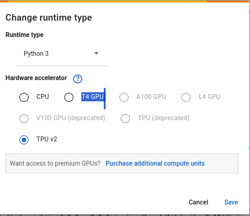

# PR_Extraction

## Overview
This project involves extracting answers text based on the submitted question by user from PDF documents, processing it to generate paraphrased answers to queries, and ensuring relevance to the provided content. The project leverages various Python libraries such as PyPDF, LangChain, and HuggingFace Transformers.

## Project Structure
```markdown
PR_Extraction/
│
├── data/
│   └── Course_exercices - SABSQ3-Big Data Engineer 2021-BigSQL.pdf
│
├── env/ # Virtual environment folder
│
├── src/
│   ├── __pycache__/
│   ├── main.py # Main script for running the model
│   ├── override_sqlite.py # Script to override the default sqlite3 library
│   ├── utils.py # Utility functions for text processing
│   ├── db1.db # Example database file
│   └── Notebook.ipynb # Jupyter Notebook for running the model in Google Colab
│
├── image.png # Image used in README
├── README.md # Project documentation
└── setup.sh # Shell script to set up the environment and run Main Script
```
## Setup and Installation

### Prerequisites
- Python 3.10 or higher
- Virtual environment tool (venv or virtualenv)

### Setting Up the Environment
To Run Locally:
1. Clone the repository:
   ```bash
   git clone https://github.com/ELMEHDIEttaki/Docs_Extraction.git
   cd PR_Extraction
   bash setup.sh


2. To Run on Virtual Environement like GoogleColab Please Work with NootBook file
    Chose the 

    like T4 GPU Upload the test PDF file from data/Course_exercices - SABSQ3-Big Data Engineer 2021-BigSQL.pdf to GoogleColab Environment.
    
